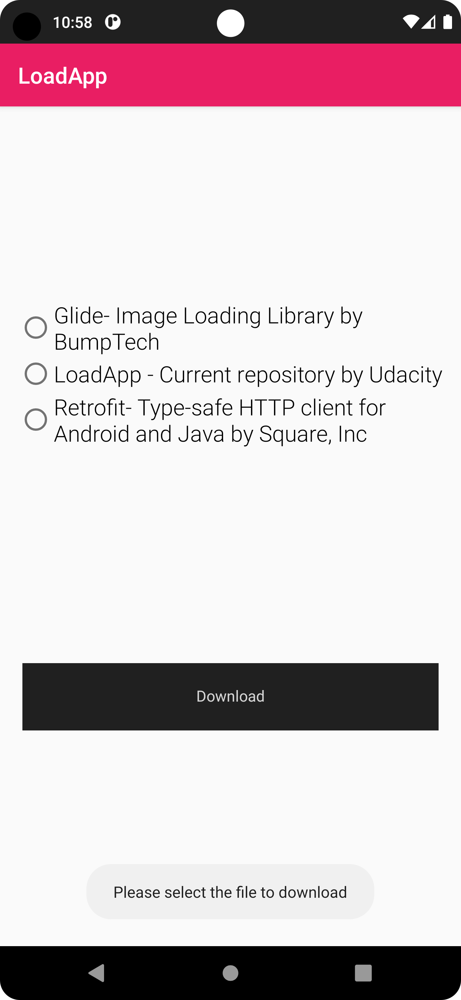

# LoadingApp

Third project of the [Android Kotlin Developer Nanodegree course](https://www.udacity.com/course/android-kotlin-developer-nanodegree--nd940), create custom views, use motion layout and push notificiations.

In this project students will create an app to download a file from Internet by clicking on a custom-built button where:
 - width of the button gets animated from left to right;
 - text gets changed based on different states of the button;
 - circle gets be animated from 0 to 360 degrees

A notification will be sent once the download is complete. When a user clicks on notification, the user lands on detail activity and the notification gets dismissed. In detail activity, the status of the download will be displayed and animated via MotionLayout upon opening the activity.

## Project Screenshots

The project has this features.
- Main
    - Load some elements to download the corresponding .zips files
    - At the end of the download, a push notifications is displayed
    - Pressing the notification button will take you to a detail screen
- Detail
    - Shows the status of the selected download

### Dependencies

This project uses the following dependencies

- [ConstraintLayout](https://developer.android.com/training/constraint-layout)
- [Navigation Components](https://developer.android.com/guide/navigation/navigation-getting-started)
- [Room](https://developer.android.com/topic/libraries/architecture/room)
- [Retrofit](https://square.github.io/retrofit/)
- [Moshi](https://github.com/square/moshi)

## Built With

* [Android Studio](https://developer.android.com/studio) - Default IDE used to build android apps
* [Kotlin](https://kotlinlang.org/) - Default language used to build this project

Include all items used to build project.

## License
Please review the following [license agreement](https://bumptech.github.io/glide/dev/open-source-licenses.html)
